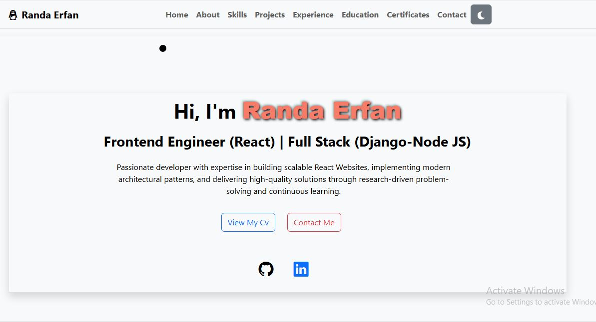

# Randa Erfan – Portfolio Website

A modern, responsive portfolio website built with **React** and **React Router** to showcase skills, projects, experience, education, certificates, and contact information. Includes a dark/light mode toggle and interactive cursor for a smooth user experience.

---


## Available Scripts

In the project directory, you can run:

### `npm start`

Runs the app in the development mode.\
Open [http://localhost:3000](http://localhost:3000) to view it in your browser.

The page will reload when you make changes.\
You may also see any lint errors in the console.

## 🛠️ Technologies Used

- **Frontend:** React, React Router, Bootstrap, Tailwind CSS, Framer Motion  
- **Tools & Utilities:** Git, GitHub, Vite  
- **Features:** Dark/Light mode, responsive design, animated cursor, gradient backgrounds, interactive project cards

---

## 📌 Sections / Features

- **Home:** Hero section with greeting and introduction  
- **About:** Overview of skills, work style, and professional profile  
- **Skills:** Highlights technical skills and proficiencies  
- **Projects:** Showcase of personal and professional projects with descriptions and links  
- **Experience:** Work history and relevant experiences  
- **Education:** Academic background and certifications  
- **Certificates:** Showcase of completed courses and certifications  
- **Contact:** Contact information with clickable email, LinkedIn, GitHub, and phone links

---

## 🎨 Design Highlights

- Dark/light mode toggle stored in **localStorage**  
- Smooth animations using **Framer Motion**  
- Full **responsive design** for desktop and mobile  
- Gradient backgrounds and clean UI for a modern look  
- Interactive cursor for a dynamic feel

---

## ⚙️ Setup Instructions

1. **Clone the repository:**

```bash
git clone https://github.com/randaabdoerfan/portfolio.git
